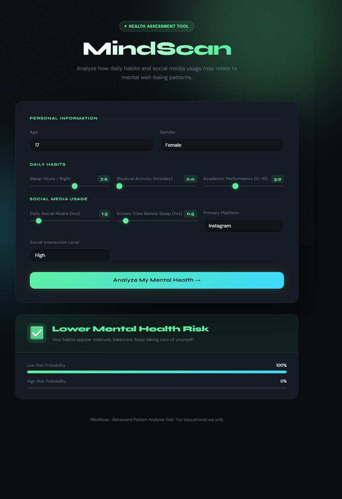

# 🧠 Social-Media-Impact-on-Teen-Mental-Health

An AI-powered web application that predicts mental health risk levels based on daily lifestyle, social media usage, and behavioral patterns using Machine Learning.

---

## 🚀 Live Features

- Predict mental health risk (Low / High)
- Interactive web UI (HTML, CSS, JavaScript)
- FastAPI backend for ML inference
- Probability-based predictions

---

## 📊 Dataset Description

The model is trained on behavioral and lifestyle data, including:

- Age
- Daily Social Media Usage
- Sleep Hours
- Screen Time Before Sleep
- Academic Performance
- Physical Activity
- Gender
- Platform Usage (Instagram / TikTok / Both)
- Social Interaction Level (Low / Medium / High)

Link: https://www.kaggle.com/datasets/algozee/teenager-menthal-healy
---

## 🤖 Machine Learning Model

Multiple models were tested including:
- Logistic Regression ✅ (Best performing)
- Other classification models (tested but not selected)

### Why Logistic Regression?
- Better generalization on small dataset
- Stable performance on imbalanced data
- Fast inference for real-time API

---

## ⚠️ Data Imbalance Handling

The dataset was imbalanced.

- Tried SMOTE (Synthetic Minority Oversampling Technique)
- However, the final deployment model used the original preprocessing pipeline
- Logistic Regression gave the best tradeoff between accuracy and stability

---

## 🧠 Tech Stack

### Backend
- FastAPI
- Python
- Scikit-learn
- Joblib

### Frontend
- HTML
- CSS
- JavaScript (Fetch API)

---

## 📸 Output Preview

After entering user data, the system predicts mental health risk along with probability scores:

